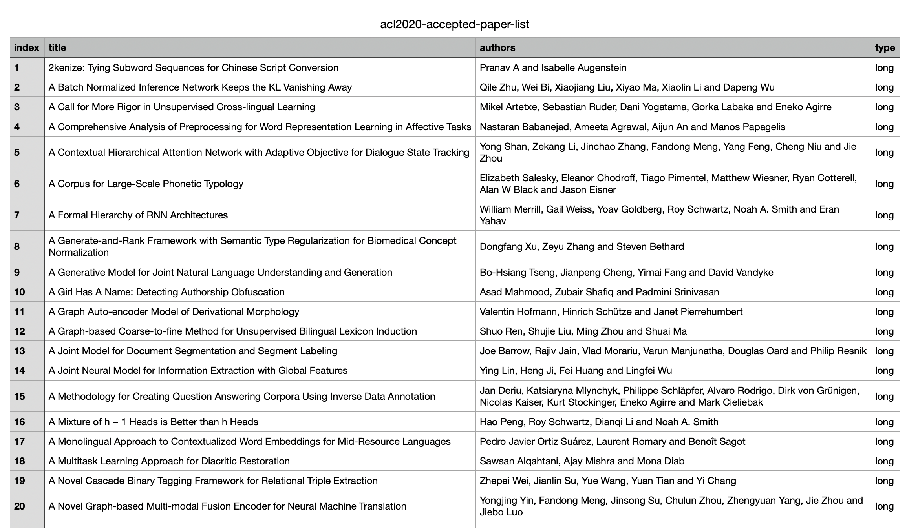

# ACL2020-Paper-Code-Blog

🗂 ACL2020 的论文、代码和博客。

> ⚠️ ACL2020 所有接受的[「论文列表」](https://acl2020.org/program/accepted/)已经放出！！！

我将所有接受的论文列表整理成了[「表格形式」](./acl2020-accepted-paper-list.csv)，预览如下：

## 1 接受的论文列表

### 对话

- ACL2020 Tutorial: Open-Domain Question Answering [\[Code\]](https://github.com/danqi/acl2020-openqa-tutorial)

- KdConv: A Chinese Multi-domain Dialogue Dataset Towards Multi-turn Knowledge-driven Conversation [\[Paper\]](https://arxiv.org/abs/2004.04100) [\[Code\]](https://github.com/thu-coai/KdConv) [\[Blog\]](https://www.zhihu.com/question/385259014/answer/1133416917)

- Multi-Agent Task-Oriented Dialog Policy Learning with Role-aware Reward Decomposition [\[Paper\]](https://arxiv.org/abs/2004.03809)

- ConvLab-2: An Open-Source Toolkit for Building, Evaluating, and Diagnosing Dialogue Systems [\[Paper\]](https://arxiv.org/abs/2002.04793)

- CrossWOZ: A Large-Scale Chinese Cross-Domain Task-Oriented Dialogue Dataset [\[Paper\]](https://arxiv.org/abs/2002.11893) [\[Code\]](https://github.com/thu-coai/CrossWOZ)

- PLATO: Pre-trained Dialogue Generation Model with Discrete Latent Variable [\[Paper\]](https://arxiv.org/abs/1910.07931)

- dynamic induction networks for few-shot text classification [\[Blog\]](https://www.zhihu.com/question/385259014/answer/1134813765)

- Learning Low-Resource End-To-End Goal-Oriented Dialog for Fast and Reliable System Deployment [\[Blog\]](https://www.zhihu.com/question/385259014/answer/1134813765)

- Data Manipulation: Towards Effective Instance Learning for Neural Dialogue Generation via Learning to Augment and Reweight [\[Paper\]](https://arxiv.org/abs/2004.02594)

- Grounding Conversations with Improvised Dialogues [\[Paper\]](https://arxiv.org/abs/2004.09544) [\[Code\]](https://github.com/wise-east/spolin)

- Zero-Shot Transfer Learning with Synthesized Data for Multi-Domain Dialogue State Tracking [\[Paper\]](https://arxiv.org/abs/2005.00891) [\[Code\]](https://github.com/stanford-oval/zero-shot-multiwoz-acl2020)

- Dialogue Coherence Assessment Without Explicit Dialogue Act Labels [\[Code\]](https://github.com/UKPLab/acl2020-dialogue-coherence-assessment)

- Dense-Caption Matching and Frame-Selection Gating for Temporal Localization in VideoQA [\[Paper\]](https://arxiv.org/abs/2005.06409) [\[Code\]](https://github.com/hyounghk/VideoQADenseCapFrameGate-ACL2020)

- Conversational Word Embedding for Retrieval-based Dialog System [\[Paper\]](https://arxiv.org/abs/2004.13249) [\[Code\]](https://github.com/wtma/PR-Embedding)

- INFOTABS: Inference on Tables as Semi-structured Data [\[Paper\]](https://arxiv.org/abs/2005.06117) [\[Code\]](https://github.com/utahnlp/infotabs-code) [\[Blog\]](https://infotabs.github.io/)

### 知识图谱

- A Re-evaluation of Knowledge Graph Completion Methods [\[Paper\]](https://arxiv.org/abs/1911.03903) [\[Code\]](https://github.com/svjan5/kg-reeval)

### 阅读理解

- A Self-training Method for Machine Reading Comprehension with Soft Evidence Extraction

### 文本生成

- ScriptWriter: Narrative-Guided Script Generation [\[Blog\]](https://www.zhihu.com/question/385259014/answer/1133999732)

- A Knowledge-Enhanced Pretraining Model for Commonsense Story Generation [\[Paper\]](https://arxiv.org/abs/2001.05139) [\[Code\]](https://github.com/JianGuanTHU/CommonsenseStoryGen)

- Pre-train and Plug-in: Flexible Conditional Text Generation with Variational Auto-Encoders [\[Paper\]](https://arxiv.org/abs/1911.03882) [\[Code\]](https://github.com/WHUIR/PPVAE)

- Logical Natural Language Generation from Open-Domain Tables [\[Paper\]](https://arxiv.org/abs/2004.10404) [\[Code\]](https://github.com/wenhuchen/LogicNLG)

## 摘要提取

- A Discourse-Aware Neural Extractive Model for Text Summarization [\[Paper\]](http://www.cs.utexas.edu/~jcxu/material/ACL20/DiscoBERT_ACL2020.pdf) [\[Code\]](https://github.com/jiacheng-xu/DiscoBERT)
- Heterogeneous Graph Neural Networks for Extractive Document Summarization [\[Paper\]](https://arxiv.org/abs/2004.12393) [\[Code\]](https://github.com/brxx122/HeterSumGraph)
- Unsupervised Opinion Summarization with Noising and Denoising [\[Paper\]](https://arxiv.org/abs/2004.10150) [\[Code\]](https://github.com/rktamplayo/DenoiseSum)

### 关系抽取

- A Novel Hierarchical Binary Tagging Framework for Relational Triple Extraction [\[Paper\]](https://arxiv.org/abs/1909.03227) [\[Code\]](https://github.com/weizhepei/HBT) [\[Blog\]](https://www.zhihu.com/question/385259014/answer/1141621197)

### 语音识别

- Modeling Code-Switch Languages Using Bilingual Parallel Corpus [\[Blog\]](https://www.zhihu.com/question/385259014/answer/1169746686)

### 翻译

- Character-Level Translation with Self-attention [\[Paper\]](https://arxiv.org/abs/2004.14788) [\[Code\]](https://github.com/CharizardAcademy/convtransformer)

- Contextual Neural Machine Translation Improves Translation of Cataphoric Pronouns [\[Paper\]](https://arxiv.org/abs/2004.09894) [\[Code\]](https://github.com/sameenmaruf/acl2020-contextnmt-cataphora)

### 其他

- GCAN: Graph-aware Co-Attention Networks for Explainable Fake News Detection on Social Media [\[Paper\]](https://arxiv.org/abs/2004.11648) [\[Code\]](https://github.com/l852888/GCAN)

- Evaluating Explainable AI: Which Algorithmic Explanations Help Users Predict Model Behavior? [\[Paper\]](https://arxiv.org/abs/2005.01831) [\[Code\]](https://github.com/peterbhase/InterpretableNLP-ACL2020)

- FastBERT: a Self-distilling BERT with Adaptive Inference Time [\[Paper\]](https://arxiv.org/abs/2004.02178) [\[Code\]](https://github.com/autoliuweijie/FastBERT) [\[Code2\]](https://github.com/BitVoyage/FastBERT)

- Attend, Translate and Summarize: An Efficient Method for Neural Cross-Lingual Summarization [\[Code\]](https://github.com/ZNLP/ATSum)

- An Effective Transition-based Model for Discontinuous NER [\[Paper\]](https://arxiv.org/abs/2004.13454) [\[Code\]](https://github.com/daixiangau/acl2020-transition-discontinuous-ner)

- AMR Parsing via Graph-Sequence Iterative Inference [\[Paper\]](https://arxiv.org/abs/2004.05572) [\[Code\]](https://github.com/jcyk/AMR-gs)

- Hypernymy Detection for Low-Resource Languages via Meta Learning [\[Code\]](https://github.com/ccclyu/metaHypernymy)

- NAT: Noise-Aware Training for Robust Neural Sequence Labeling [\[Code\]](https://github.com/mnamysl/nat-acl2020)

- R^3: Reverse, Retrieve, and Rank for Sarcasm Generation with Commonsense Knowledge [\[Paper\]](https://arxiv.org/abs/2004.13248) [\[Code\]](https://github.com/tuhinjubcse/SarcasmGeneration-ACL2020)

- Learning Constraints for Structured Prediction Using Rectifier Networks [\[Code\]](https://github.com/utahnlp/learning-constraints)

- Contrastive Self-Supervised Learning for Commonsense Reasoning [\[Paper\]](https://arxiv.org/abs/2005.00669) [\[Code\]](https://github.com/SAP-samples/acl2020-commonsense)

- Transformer Anatomy: Roles and Utilization of Attention Heads in Transformer-based Neural Language Models [\[Code\]](https://github.com/heartcored98/transformer_anatomy)

- Improving Segmentation for Technical Support Problems [\[Code\]](https://github.com/kushalchauhan98/ticket-segmentation)

- AMR Parsing with Latent Structural Information [\[Code\]](https://github.com/zhouqiji/ACL2020_AMR_Parsing)

- From Zero to Hero: Human-In-The-Loop Entity Linking in Low Resource Domains [\[Code\]](https://github.com/UKPLab/acl2020-interactive-entity-linking)

- Diverse and Informative Dialogue Generation with Context-Specific Commonsense Knowledge Awareness [\[Code\]](https://github.com/pku-orangecat/ACL2020-ConKADI)

- Supervised Grapheme-to-Phoneme Conversion of Orthographic Schwas in Hindi and Punjabi [\[Paper\]](https://arxiv.org/abs/2004.10353) [\[Code\]](https://github.com/aryamanarora/schwa-deletion)

- Mind the Trade-off: Debiasing NLU Models without Degrading the In-distribution Performance [\[Paper\]](https://arxiv.org/abs/2005.00315) [\[Code\]](https://github.com/UKPLab/acl2020-confidence-regularization)

- On the Robustness of Language Encoders against Grammatical Errors [Paper\]](https://arxiv.org/abs/2005.05683) [\[Code\]](https://github.com/uclanlp/ProbeGrammarRobustness)

- Will-They-Won’t-They: A Very Large Dataset for Stance Detection on Twitter [Paper\]](https://arxiv.org/abs/2005.00388) [\[Code\]](https://github.com/cambridge-wtwt/acl2020-wtwt-tweets)

- Semi-supervised Contextual Historical Text Normalization [\[Code\]](https://github.com/ZurichNLP/acl2020-historical-text-normalization)

- Empowering Active Learning to Jointly Optimize System and User Demands [Paper\]](https://arxiv.org/abs/2005.04470) [\[Code\]](https://github.com/UKPLab/acl2020-empowering-active-learning)

- Enhancing Pre-trained Chinese Character Representation with Word-aligned Attention [\[Code\]](https://github.com/lsvih/MWA)

- Refer360°: A Referring Expression Recognition Dataset in 360°Images [\[Code\]](https://github.com/volkancirik/refer360)

- Tree-Structured Neural Topic Model [\[Code\]](https://github.com/misonuma/tsntm)

- A Contextual Hierarchical Attention Network with Adaptive Objective for Dialogue State Tracking  [\[Code\]](https://github.com/ictnlp/CHAN-DST)

- MOOCCube: A Large-scale Data Repository for NLP Applications in MOOCs [\[Code\]](https://github.com/thukg/MOOCCube) [\[Blog\]](http://moocdata.cn/data/MOOCCube)

- Fact-based Content Weighting for Evaluating Abstractive Summarisation [\[Code\]](https://github.com/XinnuoXu/Human_eva)

## 2 未接受的论文列表

未被接受并不表面工作没有意义，也可能是不幸运！

- BP-Transformer: Modelling Long-Range Context via Binary Partitioning [\[Paper\]](https://arxiv.org/abs/1911.04070) [\[Code\]](https://github.com/yzh119/BPT) [\[Blog\]](https://www.zhihu.com/question/371534652/answer/1016231768)

## 3 相关资料

- [ACL2020 官网](https://acl2020.org/)
- [ACL 2020程序委员会博客（中文版）](https://github.com/ymcui/ACL2020-PC-Blogs-Chinese)
- [如何看待ACL 2020录用结果？](https://www.zhihu.com/question/384287944)
- [ACL 2020有哪些值得关注的论文？](https://www.zhihu.com/question/385259014)
- [ACL2020论文精选](https://zhuanlan.zhihu.com/p/135204349)
